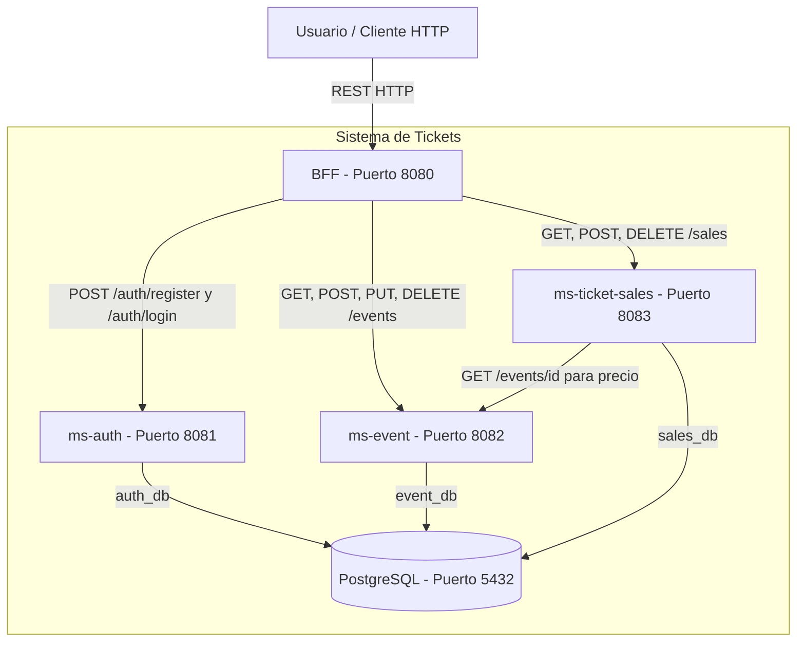
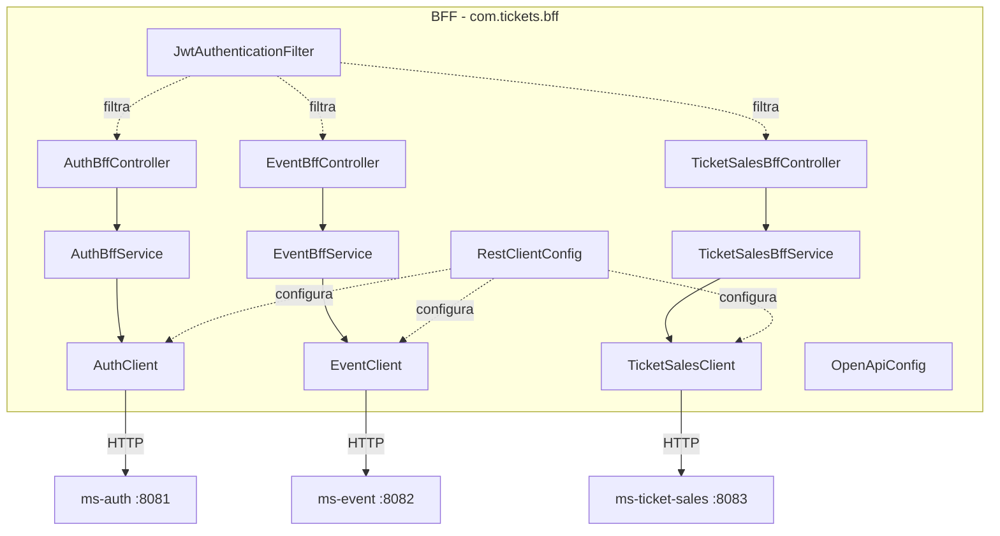
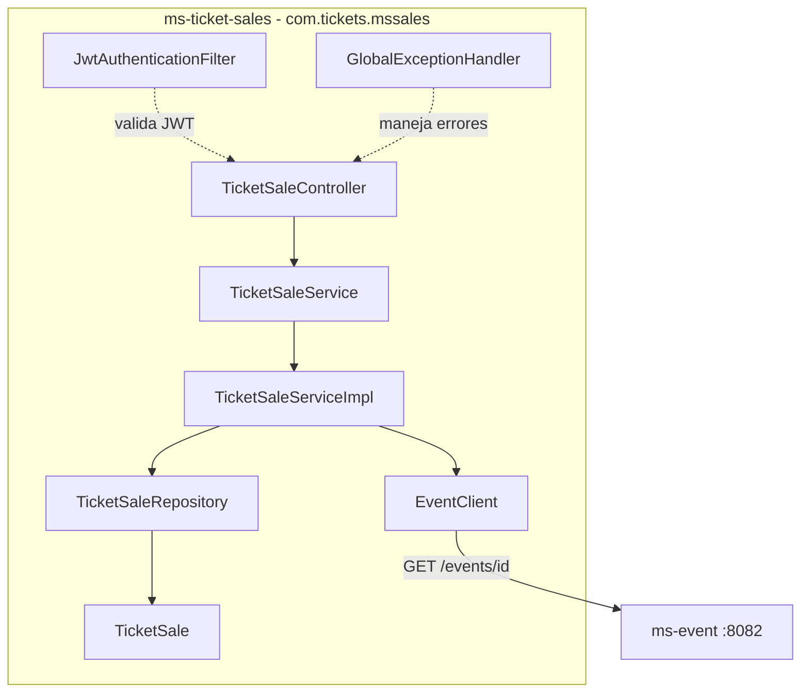

# Sistema de Gestion de Eventos y Venta de Entradas

## Problema

El cliente actualmente:

- Registra eventos manualmente en papel.
- Lleva control de asistentes sin sistema digital.
- Registra ventas manualmente sin trazabilidad.
- No conoce la disponibilidad real de entradas.
- Pierde informacion frecuentemente.
- No tiene historial digital de ventas.

## Solucion

Sistema de microservicios que digitaliza completamente:

- Creacion y gestion de eventos.
- Venta de entradas con calculo automatico de totales.
- Registro historico de ventas.
- Seguridad mediante JWT con validacion centralizada.
- Consumo unificado mediante BFF.

---

## Arquitectura

El sistema sigue una arquitectura de microservicios con un BFF (Backend for Frontend) como punto de entrada centralizado.

### Tabla de Puertos

| Servicio        | Puerto | Descripcion                                     |
|-----------------|--------|-------------------------------------------------|
| BFF             | 8080   | Punto de entrada centralizado, proxy con JWT    |
| ms-auth         | 8081   | Registro, login y validacion de tokens JWT      |
| ms-event        | 8082   | CRUD de eventos                                 |
| ms-ticket-sales | 8083   | Venta de entradas y calculo de totales          |
| PostgreSQL      | 5432   | Base de datos relacional (3 bases logicas)      |

### Bases de Datos

Una sola instancia PostgreSQL con tres bases logicas separadas:

| Base de datos | Microservicio   | Tablas         |
|---------------|-----------------|----------------|
| `auth_db`     | ms-auth         | `users`        |
| `event_db`    | ms-event        | `events`       |
| `sales_db`    | ms-ticket-sales | `ticket_sales` |

---

## Diagrama C2 - Contenedores



---

## Diagrama C3 - Componentes del BFF



---

## Diagrama C3 - Componentes de ms-ticket-sales



---

## Flujo JWT

```
1. Cliente POST /api/auth/login  (BFF :8080)
2. BFF reenvía a ms-auth :8081
3. ms-auth valida credenciales y genera JWT
4. JWT retorna al cliente
5. Cliente incluye JWT en Authorization: Bearer <token>
6. BFF valida el token localmente via JwtUtil
7. BFF reenvía request + header al microservicio destino
8. Microservicio valida JWT con su propio JwtUtil
9. Microservicio ejecuta operacion y retorna respuesta
```

---

## Flujo de Venta de Entradas

```
1. Cliente POST /api/sales  (BFF :8080)  { eventId, comprador, cantidadEntradas }
2. BFF valida JWT y reenvía a ms-ticket-sales :8083
3. ms-ticket-sales consulta ms-event GET /events/{id}
4. ms-event retorna { precioEntrada, ... }
5. ms-ticket-sales calcula total = precioEntrada * cantidadEntradas
6. ms-ticket-sales guarda TicketSale en sales_db
7. ms-ticket-sales retorna TicketSaleResponseDto al BFF
8. BFF retorna 201 Created al cliente
```

---

## Docker Compose

### Ejecutar el sistema completo

```bash
docker-compose up --build
```

### Verificar servicios

```bash
docker-compose ps
```

### Detener el sistema

```bash
docker-compose down
```

### Limpiar volumenes (resetear base de datos)

```bash
docker-compose down -v
```

---

## Swagger UI

Cada microservicio expone su propia documentacion Swagger:

| Servicio        | URL Swagger                                   |
|-----------------|-----------------------------------------------|
| BFF             | http://localhost:8080/swagger-ui.html         |
| ms-auth         | http://localhost:8081/swagger-ui.html         |
| ms-event        | http://localhost:8082/swagger-ui.html         |
| ms-ticket-sales | http://localhost:8083/swagger-ui.html         |

---

## Endpoints

### BFF (puerto 8080)

#### Autenticacion (sin JWT)
| Metodo | Endpoint               | Descripcion          |
|--------|------------------------|----------------------|
| POST   | /api/auth/register     | Registrar usuario    |
| POST   | /api/auth/login        | Iniciar sesion       |

#### Eventos (requiere JWT)
| Metodo | Endpoint               | Descripcion          |
|--------|------------------------|----------------------|
| GET    | /api/events            | Listar eventos       |
| GET    | /api/events/{id}       | Obtener evento       |
| POST   | /api/events            | Crear evento         |
| PUT    | /api/events/{id}       | Actualizar evento    |
| DELETE | /api/events/{id}       | Eliminar evento      |

#### Ventas (requiere JWT)
| Metodo | Endpoint               | Descripcion          |
|--------|------------------------|----------------------|
| GET    | /api/sales             | Listar ventas        |
| GET    | /api/sales/{id}        | Obtener venta        |
| POST   | /api/sales             | Registrar venta      |
| DELETE | /api/sales/{id}        | Eliminar venta       |

---

## Instrucciones de Ejecucion

### Prerequisitos

- Docker Desktop instalado y corriendo
- Puerto 5432, 8080, 8081, 8082, 8083 disponibles

### Paso 1 - Clonar y entrar al directorio

```bash
cd ticket-system
```

### Paso 2 - Construir e iniciar todos los servicios

```bash
docker-compose up --build
```

### Paso 3 - Registrar un usuario

```bash
curl -X POST http://localhost:8080/api/auth/register \
  -H "Content-Type: application/json" \
  -d '{"username":"admin","email":"admin@test.com","password":"123456"}'
```

### Paso 4 - Iniciar sesion y obtener JWT

```bash
curl -X POST http://localhost:8080/api/auth/login \
  -H "Content-Type: application/json" \
  -d '{"username":"admin","password":"123456"}'
```

Guardar el valor del campo `token` de la respuesta.

### Paso 5 - Crear un evento

```bash
curl -X POST http://localhost:8080/api/events \
  -H "Content-Type: application/json" \
  -H "Authorization: Bearer <token>" \
  -d '{
    "nombre": "Concierto Rock",
    "descripcion": "Gran concierto en el estadio",
    "fecha": "2026-09-15T20:00:00",
    "ubicacion": "Estadio Nacional, Santiago",
    "capacidad": 50000,
    "precioEntrada": 25000.00
  }'
```

### Paso 6 - Comprar entradas

```bash
curl -X POST http://localhost:8080/api/sales \
  -H "Content-Type: application/json" \
  -H "Authorization: Bearer <token>" \
  -d '{
    "eventId": "<uuid-del-evento>",
    "comprador": "Juan Perez",
    "cantidadEntradas": 2
  }'
```

El sistema calcula automaticamente: `total = 25000.00 * 2 = 50000.00`

---

## Estructura del Proyecto

```
ticket-system/
├── bff/
│   └── src/main/java/com/tickets/bff/
│       ├── client/          # AuthClient, EventClient, TicketSalesClient
│       ├── config/          # RestClientConfig, OpenApiConfig
│       ├── controller/      # AuthBffController, EventBffController, TicketSalesBffController
│       ├── dto/             # DTOs de request y response
│       ├── exception/handler/  # GlobalExceptionHandler
│       ├── security/        # JwtUtil, JwtAuthenticationFilter, SecurityConfig
│       └── service/         # AuthBffService, EventBffService, TicketSalesBffService
├── ms-auth/
│   └── src/main/java/com/tickets/msauth/
│       ├── config/          # OpenApiConfig
│       ├── controller/      # AuthController
│       ├── dto/request/     # LoginRequest, RegisterRequest
│       ├── dto/response/    # AuthResponse, ErrorResponse, UserResponse
│       ├── entity/          # User
│       ├── exception/       # InvalidCredentialsException, UserAlreadyExistsException
│       ├── exception/handler/ # GlobalExceptionHandler
│       ├── repository/      # UserRepository
│       ├── security/        # JwtUtil, SecurityConfig
│       └── service/impl/    # AuthService, AuthServiceImpl
├── ms-event/
│   └── src/main/java/com/tickets/msevent/
│       ├── config/          # OpenApiConfig
│       ├── controller/      # EventController
│       ├── dto/request/     # EventRequestDto
│       ├── dto/response/    # EventResponseDto, ErrorResponse
│       ├── entity/          # Event (UUID id)
│       ├── exception/       # EventNotFoundException, EventAlreadyExistsException
│       ├── exception/handler/ # GlobalExceptionHandler
│       ├── repository/      # EventRepository
│       ├── security/        # JwtUtil, JwtAuthenticationFilter, SecurityConfig
│       └── service/impl/    # EventService, EventServiceImpl
├── ms-ticket-sales/
│   └── src/main/java/com/tickets/mssales/
│       ├── client/          # EventClient (llama a ms-event)
│       ├── config/          # OpenApiConfig
│       ├── controller/      # TicketSaleController
│       ├── dto/request/     # TicketSaleRequestDto
│       ├── dto/response/    # TicketSaleResponseDto, ErrorResponse
│       ├── entity/          # TicketSale (UUID id, UUID eventId)
│       ├── exception/       # SaleNotFoundException, BusinessException
│       ├── exception/handler/ # GlobalExceptionHandler
│       ├── repository/      # TicketSaleRepository
│       ├── security/        # JwtUtil, JwtAuthenticationFilter, SecurityConfig
│       └── service/impl/    # TicketSaleService, TicketSaleServiceImpl
├── docker-compose.yml
├── init-db.sql
└── README.md
```
